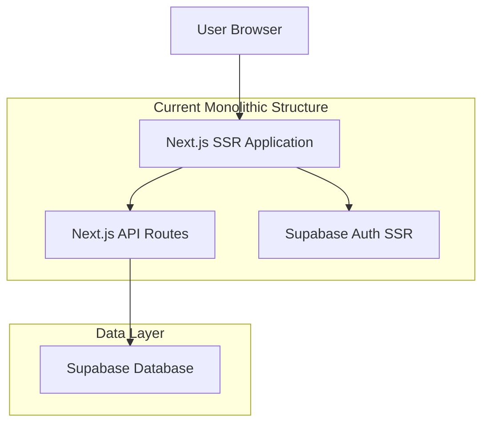
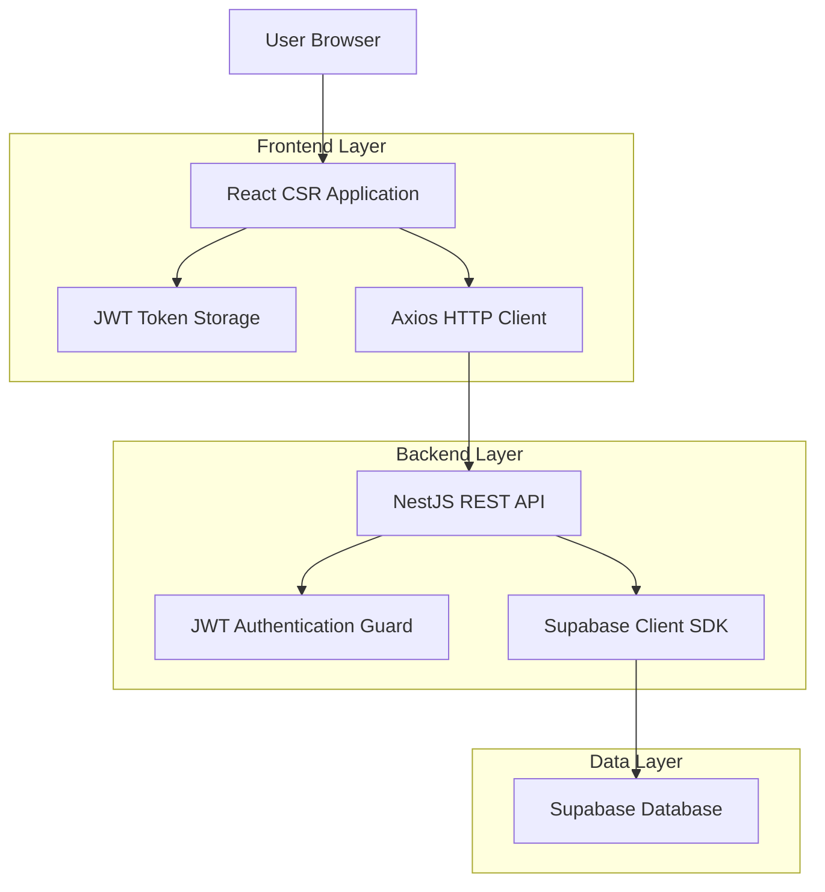
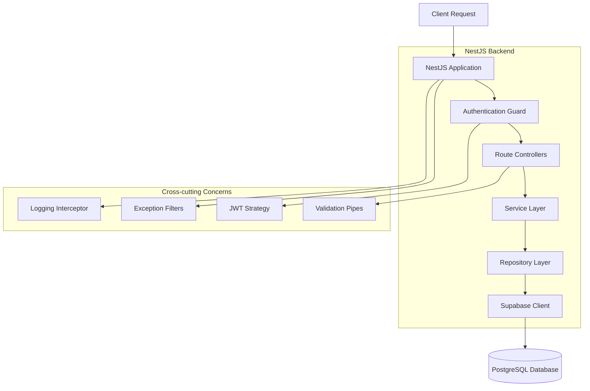
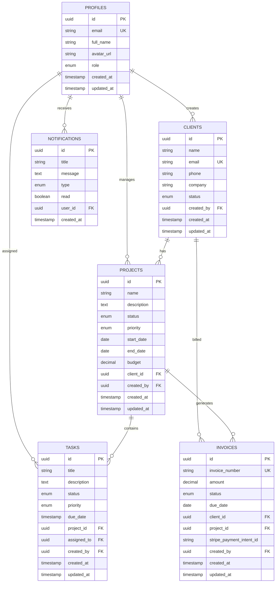

# CSR Migration Technical Architecture Document

## 1. Architecture Design

### Current Architecture (Next.js SSR)


### New Architecture (CSR + NestJS)


## 2. Technology Description

### Frontend Stack
- **React@18** - Core UI library with hooks and context
- **Vite** - Fast build tool and dev server (replacing Next.js)
- **TypeScript** - Type safety and better DX
- **TailwindCSS@3** - Utility-first CSS framework
- **React Router@6** - Client-side routing
- **Axios** - HTTP client for API communication
- **Zustand** - Lightweight state management
- **React Query/TanStack Query** - Server state management and caching

### Backend Stack
- **NestJS@10** - Node.js framework with decorators and dependency injection
- **TypeScript** - Shared types between frontend and backend
- **Passport JWT** - JWT authentication strategy
- **Class Validator** - Request validation
- **Supabase JS SDK** - Database client
- **Swagger/OpenAPI** - API documentation

### Database
- **Supabase (PostgreSQL)** - Existing database structure maintained
- **Row Level Security (RLS)** - Database-level security policies

## 3. Route Definitions

### Frontend Routes (React Router)
| Route | Purpose | Auth Required |
|-------|---------|---------------|
| `/login` | Authentication page | No |
| `/` | Redirect to dashboard | Yes |
| `/dashboard` | Main dashboard with metrics | Yes |
| `/clients` | Client list and management | Yes |
| `/clients/:id` | Client detail view | Yes |
| `/reports` | Analytics and reports | Yes |
| `/reports/export` | Data export functionality | Yes |

### Protected Route Structure
```typescript
// Protected route wrapper
<ProtectedRoute requiredRole="admin">
  <Dashboard />
</ProtectedRoute>
```

## 4. API Definitions

### 4.1 Authentication APIs

**Login**
```
POST /api/auth/login
```

Request:
| Param Name | Param Type | Required | Description |
|------------|------------|----------|-------------|
| email | string | true | User email address |
| password | string | true | User password |

Response:
| Param Name | Param Type | Description |
|------------|------------|-------------|
| access_token | string | JWT access token |
| refresh_token | string | JWT refresh token |
| user | UserProfile | User profile data |
| expires_in | number | Token expiration time |

Example Response:
```json
{
  "access_token": "eyJhbGciOiJIUzI1NiIsInR5cCI6IkpXVCJ9...",
  "refresh_token": "eyJhbGciOiJIUzI1NiIsInR5cCI6IkpXVCJ9...",
  "user": {
    "id": "uuid",
    "email": "admin@example.com",
    "full_name": "Admin User",
    "role": "admin"
  },
  "expires_in": 3600
}
```

**Refresh Token**
```
POST /api/auth/refresh
```

**Logout**
```
POST /api/auth/logout
```

### 4.2 Client Management APIs

**Get Clients**
```
GET /api/clients
```

Query Parameters:
| Param Name | Param Type | Required | Description |
|------------|------------|----------|-------------|
| page | number | false | Page number (default: 1) |
| limit | number | false | Items per page (default: 10) |
| search | string | false | Search term |
| status | string | false | Filter by status |

**Create Client**
```
POST /api/clients
```

**Update Client**
```
PATCH /api/clients/:id
```

**Delete Client**
```
DELETE /api/clients/:id
```

**Bulk Operations**
```
POST /api/clients/bulk
```

### 4.3 Reports APIs

**Get Metrics**
```
GET /api/reports/metrics
```

**Get Analytics**
```
GET /api/reports/analytics
```

**Export Data**
```
POST /api/reports/export
```

### 4.4 TypeScript Interfaces

```typescript
// Shared types between frontend and backend
export interface UserProfile {
  id: string;
  email: string;
  full_name: string;
  role: 'admin' | 'manager' | 'user';
  created_at: string;
  updated_at: string;
}

export interface Client {
  id: string;
  name: string;
  email: string;
  phone?: string;
  company?: string;
  status: 'active' | 'inactive' | 'pending';
  created_at: string;
  updated_at: string;
  created_by: string;
}

export interface AuthResponse {
  access_token: string;
  refresh_token: string;
  user: UserProfile;
  expires_in: number;
}

export interface PaginatedResponse<T> {
  data: T[];
  total: number;
  page: number;
  limit: number;
  totalPages: number;
}
```

## 5. Server Architecture Diagram



## 6. Data Model

### 6.1 Data Model Definition



### 6.2 Database Schema (Existing - No Changes Required)

The existing Supabase schema will be maintained as-is. The migration only affects the application layer, not the database structure.

## 7. Migration Strategy

### Phase 1: Backend Setup (Week 1)
1. **Initialize NestJS Project**
   - Set up new NestJS application
   - Configure TypeScript and project structure
   - Install required dependencies

2. **Authentication Module**
   - Implement JWT authentication strategy
   - Create auth controller and service
   - Set up Passport JWT guards

3. **Database Integration**
   - Configure Supabase client in NestJS
   - Create database service layer
   - Implement repository pattern

### Phase 2: API Migration (Week 2)
1. **Core API Endpoints**
   - Migrate `/api/clients/*` routes
   - Migrate `/api/reports/*` routes
   - Implement validation and error handling

2. **Testing & Documentation**
   - Write unit tests for services
   - Generate Swagger documentation
   - Test API endpoints with Postman

### Phase 3: Frontend Conversion (Week 3)
1. **React Setup**
   - Create new Vite + React project
   - Set up routing with React Router
   - Configure TailwindCSS and UI components

2. **Authentication Flow**
   - Implement JWT token management
   - Create protected route wrapper
   - Set up axios interceptors for token handling

3. **Component Migration**
   - Convert Next.js pages to React components
   - Update API calls to use axios
   - Implement React Query for state management

### Phase 4: Integration & Testing (Week 4)
1. **End-to-End Testing**
   - Test complete authentication flow
   - Verify all CRUD operations
   - Test real-time features

2. **Performance Optimization**
   - Implement code splitting
   - Optimize bundle size
   - Add loading states and error boundaries

3. **Deployment Setup**
   - Configure production builds
   - Set up environment variables
   - Deploy both frontend and backend

## 8. Key Benefits of Migration

### Simplified Architecture
- **Separation of Concerns**: Clear separation between frontend and backend
- **Independent Scaling**: Frontend and backend can be scaled independently
- **Technology Flexibility**: Easier to upgrade or replace individual components

### Improved Developer Experience
- **Faster Development**: Hot reload and faster build times with Vite
- **Better Debugging**: Clearer error boundaries between client and server
- **API Documentation**: Auto-generated Swagger documentation

### Enhanced Security
- **Stateless Authentication**: JWT tokens eliminate server-side session management
- **API-First Design**: Consistent security policies across all endpoints
- **Role-Based Access Control**: Centralized authorization logic

### Better Performance
- **Client-Side Caching**: React Query provides intelligent caching
- **Reduced Server Load**: Static frontend reduces server resource usage
- **Optimized Bundles**: Vite provides better tree-shaking and code splitting

## 9. Implementation Checklist

### Backend (NestJS)
- [ ] Set up NestJS project structure
- [ ] Configure Supabase client
- [ ] Implement JWT authentication
- [ ] Create user management module
- [ ] Create client management module
- [ ] Create reports module
- [ ] Add validation and error handling
- [ ] Write unit tests
- [ ] Generate API documentation

### Frontend (React CSR)
- [ ] Set up Vite + React project
- [ ] Configure React Router
- [ ] Set up TailwindCSS
- [ ] Implement authentication context
- [ ] Create protected route wrapper
- [ ] Convert dashboard components
- [ ] Convert client management pages
- [ ] Convert reports pages
- [ ] Add loading states and error handling
- [ ] Implement React Query for API calls

### Integration
- [ ] Test authentication flow
- [ ] Test all CRUD operations
- [ ] Verify role-based access control
- [ ] Test real-time features
- [ ] Performance testing
- [ ] Security testing
- [ ] Deploy to production

This migration will transform your admin dashboard into a modern, scalable, and maintainable application with clear separation of concerns and improved developer experience.