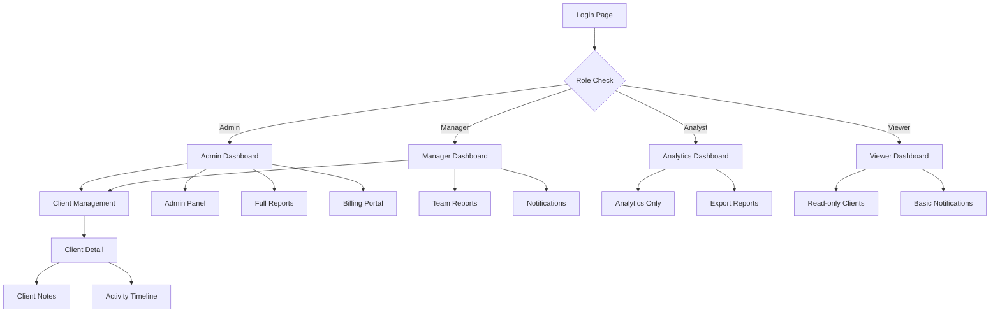

# Admin Dashboard - Product Requirements Document

## 1. Product Overview

A production-grade web-based admin dashboard for internal SaaS tool management, enabling comprehensive client management, analytics reporting, billing operations, and team collaboration with real-time updates.

The dashboard solves the critical need for centralized business operations management, serving internal teams (admins, managers, analysts, viewers) with role-based access to client data, financial metrics, and operational insights. This system aims to streamline internal workflows and provide actionable business intelligence for data-driven decision making.

## 2. Core Features

### 2.1 User Roles

| Role | Registration Method | Core Permissions |
|------|---------------------|------------------|
| Admin | System invitation with admin privileges | Full system access, user management, billing configuration, audit logs |
| Manager | Admin invitation with manager role | Client management, reports access, team oversight, limited admin functions |
| Analyst | Manager/Admin invitation | Read-only analytics, report generation, data export capabilities |
| Viewer | Team invitation with basic access | Read-only dashboard access, basic client information viewing |

### 2.2 Feature Module

Our admin dashboard consists of the following main pages:

1. **Login Page**: Authentication form, magic link option, role-based redirect
2. **Main Dashboard**: Key metrics overview, charts visualization, quick actions panel
3. **Client Management**: Client list with filters, CRUD operations, bulk actions
4. **Client Detail Page**: Individual client profile, notes timeline, activity history
5. **Reports & Analytics**: Interactive charts, date filters, CSV export functionality
6. **Notifications Center**: In-app alerts, notification history, read/unread status
7. **Admin Panel**: User management, role assignment, system configuration
8. **Billing Portal**: Stripe integration, subscription management, payment history

### 2.3 Page Details

| Page Name | Module Name | Feature description |
|-----------|-------------|---------------------|
| Login Page | Authentication Form | Handle email/password login, magic link authentication, JWT token management, role-based redirection |
| Login Page | Security Features | Rate limiting, CSRF protection, secure session handling |
| Main Dashboard | Metrics Overview | Display total clients, MRR, active subscriptions, churn rate, ARPU with real-time updates |
| Main Dashboard | Charts Visualization | Interactive MRR trends, client distribution by plan, revenue analytics using Recharts |
| Main Dashboard | Quick Actions | Create new client, send notification, export reports, access billing portal |
| Client Management | Client List | Paginated table with search, filters by status/plan/owner, bulk operations |
| Client Management | CRUD Operations | Create, read, update, delete client records with form validation |
| Client Management | Real-time Updates | Live client list updates, status changes, new client notifications |
| Client Detail Page | Client Profile | Comprehensive client information, contact details, subscription status, MRR tracking |
| Client Detail Page | Notes & Timeline | Add/edit client notes, activity history, interaction timeline with timestamps |
| Client Detail Page | Activity Tracking | Log client interactions, status changes, payment events, communication history |
| Reports & Analytics | Interactive Charts | Customizable date ranges, multiple chart types, drill-down capabilities |
| Reports & Analytics | Data Export | CSV/Excel export, scheduled reports, email delivery options |
| Reports & Analytics | Advanced Filters | Filter by client segments, date ranges, revenue thresholds, plan types |
| Notifications Center | Alert Management | Display system alerts, client updates, billing notifications, team messages |
| Notifications Center | Notification Actions | Mark as read/unread, bulk actions, notification preferences |
| Admin Panel | User Management | Invite users, assign roles, deactivate accounts, audit user activities |
| Admin Panel | System Configuration | Manage organization settings, integration configurations, security policies |
| Billing Portal | Stripe Integration | Customer portal access, subscription management, payment method updates |
| Billing Portal | Payment Tracking | Transaction history, failed payment alerts, subscription status monitoring |

## 3. Core Process

**Admin Flow:**
Admins log in and access the main dashboard to view system-wide metrics. They can manage all clients, invite new team members, configure system settings, and access comprehensive analytics. Admins handle billing configurations, monitor subscription health, and manage user roles across the organization.

**Manager Flow:**
Managers access the dashboard to oversee their assigned clients and team performance. They can create and edit client records, generate reports for their department, send notifications to team members, and monitor client health metrics. Managers have limited admin functions for their specific organizational scope.

**Analyst Flow:**
Analysts focus on data analysis and reporting. They access read-only dashboards, generate custom reports with various filters, export data for external analysis, and create scheduled reports for stakeholders. They can view client trends and provide insights but cannot modify client data.

**Viewer Flow:**
Viewers have basic read-only access to view client information and basic metrics relevant to their role. They can access assigned client profiles, view notifications directed to them, and access limited reporting features based on their permissions.

## 4. User Interface Design

### 4.1 Design Style

- **Primary Colors**: Deep blue (#1e40af) for headers and primary actions, light blue (#3b82f6) for secondary elements
- **Secondary Colors**: Gray scale (#f8fafc to #1e293b) for backgrounds and text, green (#10b981) for success states, red (#ef4444) for errors
- **Button Style**: Rounded corners (8px radius), subtle shadows, hover states with color transitions
- **Font**: Inter font family, 14px base size for body text, 16px for form inputs, 24px+ for headings
- **Layout Style**: Card-based design with subtle borders, sidebar navigation, responsive grid system
- **Icons**: Lucide React icons with consistent 20px size, outline style for better clarity

### 4.2 Page Design Overview

| Page Name | Module Name | UI Elements |
|-----------|-------------|-------------|
| Login Page | Authentication Form | Centered card layout, gradient background, clean form inputs with floating labels, primary blue submit button |
| Main Dashboard | Metrics Cards | 4-column grid of metric cards with icons, large numbers, trend indicators, subtle shadows |
| Main Dashboard | Charts Section | Full-width chart containers, interactive tooltips, date picker controls, export buttons |
| Client Management | Data Table | Striped table rows, sortable headers, search bar, filter dropdowns, pagination controls |
| Client Management | Action Buttons | Floating action button for new client, inline edit/delete icons, bulk action toolbar |
| Client Detail Page | Profile Header | Large client name, status badge, key metrics in horizontal layout, action buttons |
| Client Detail Page | Tabbed Content | Tab navigation for notes, timeline, billing, with smooth transitions |
| Reports & Analytics | Filter Panel | Collapsible sidebar with date pickers, multi-select dropdowns, apply/reset buttons |
| Notifications Center | Notification List | Card-based layout, unread indicators, timestamp formatting, action buttons |
| Admin Panel | Management Tables | Clean data tables with role badges, status indicators, inline editing capabilities |
| Billing Portal | Integration Frame | Embedded Stripe portal with consistent header, loading states, error handling |

### 4.3 Responsiveness

Desktop-first responsive design with mobile-adaptive breakpoints at 768px and 1024px. Touch interaction optimization for mobile devices including larger tap targets, swipe gestures for navigation, and optimized form inputs. Sidebar navigation collapses to hamburger menu on mobile, tables become horizontally scrollable, and charts adapt to smaller screen sizes while maintaining readability.