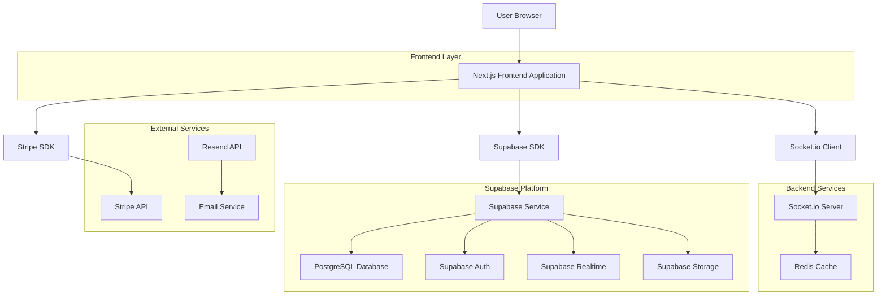

# Admin Dashboard - Technical Architecture Document

## 1. Architecture Design



## 2. Technology Description

- Frontend: React@19 + Next.js@15 (App Router) + TypeScript + Tailwind CSS@4 + shadcn/ui + React Hook Form + Zod + Lucide React + Recharts
- Backend: Next.js API Routes + Socket.io + Supabase
- Database: Supabase (PostgreSQL with RLS)
- Authentication: Supabase Auth (JWT-based)
- Real-time: Supabase Realtime + Socket.io
- Payments: Stripe API
- Email: Resend API
- Caching: Redis (for Socket.io sessions)

## 3. Route Definitions

| Route | Purpose |
|-------|---------|
| /login | Authentication page with email/password and magic link options |
| / | Main dashboard displaying key metrics, charts, and quick actions |
| /clients | Client management page with list view, search, and filters |
| /clients/[id] | Individual client detail page with notes and activity timeline |
| /reports | Analytics and reporting page with interactive charts and exports |
| /notifications | In-app notification center with read/unread management |
| /admin/users | User management page for admins to manage roles and permissions |
| /billing | Billing portal integration with Stripe customer portal |

## 4. API Definitions

### 4.1 Core API

**Authentication APIs**
```
POST /api/auth/login
```
Request:
| Param Name | Param Type | isRequired | Description |
|------------|------------|------------|-------------|
| email | string | true | User email address |
| password | string | true | User password |

Response:
| Param Name | Param Type | Description |
|------------|------------|-------------|
| user | object | User profile with role information |
| session | object | JWT session token |

**Client Management APIs**
```
GET /api/clients
POST /api/clients
PATCH /api/clients/[id]
DELETE /api/clients/[id]
```

Request (POST/PATCH):
| Param Name | Param Type | isRequired | Description |
|------------|------------|------------|-------------|
| name | string | true | Client company name |
| email | string | true | Primary contact email |
| owner_id | string | true | Assigned account owner UUID |
| plan | string | true | Subscription plan type |
| mrr | number | false | Monthly recurring revenue |
| tags | string[] | false | Client categorization tags |

Response:
| Param Name | Param Type | Description |
|------------|------------|-------------|
| id | string | Client UUID |
| name | string | Client company name |
| status | string | Active, inactive, or trial status |
| created_at | string | ISO timestamp |

**Notifications APIs**
```
GET /api/notifications
POST /api/notifications
PATCH /api/notifications/[id]/read
```

**Reports APIs**
```
GET /api/reports/metrics
POST /api/reports/export
```

**Stripe Webhook**
```
POST /api/stripe/webhook
```

**User Management APIs**
```
GET /api/users
POST /api/users/invite
PATCH /api/users/[id]/role
```

Example Request:
```json
{
  "name": "Acme Corporation",
  "email": "contact@acme.com",
  "owner_id": "550e8400-e29b-41d4-a716-446655440000",
  "plan": "enterprise",
  "mrr": 2500,
  "tags": ["enterprise", "priority"]
}
```

## 5. Server Architecture Diagram


## 6. Data Model

### 6.1 Data Model Definition


### 6.2 Data Definition Language

**Organizations Table**
```sql
-- Create organizations table
CREATE TABLE organizations (
    id UUID PRIMARY KEY DEFAULT gen_random_uuid(),
    name VARCHAR(255) NOT NULL,
    created_at TIMESTAMP WITH TIME ZONE DEFAULT NOW(),
    updated_at TIMESTAMP WITH TIME ZONE DEFAULT NOW()
);

-- Enable RLS
ALTER TABLE organizations ENABLE ROW LEVEL SECURITY;

-- RLS Policies
CREATE POLICY "Users can view their organization" ON organizations
    FOR SELECT USING (id IN (
        SELECT org_id FROM profiles WHERE auth_user_id = auth.uid()
    ));
```

**Profiles Table**
```sql
-- Create profiles table
CREATE TABLE profiles (
    id UUID PRIMARY KEY DEFAULT gen_random_uuid(),
    auth_user_id UUID REFERENCES auth.users(id) ON DELETE CASCADE,
    org_id UUID REFERENCES organizations(id) ON DELETE CASCADE,
    full_name VARCHAR(255) NOT NULL,
    role VARCHAR(50) NOT NULL CHECK (role IN ('admin', 'manager', 'analyst', 'viewer')),
    email VARCHAR(255) NOT NULL,
    created_at TIMESTAMP WITH TIME ZONE DEFAULT NOW(),
    updated_at TIMESTAMP WITH TIME ZONE DEFAULT NOW(),
    UNIQUE(auth_user_id)
);

-- Enable RLS
ALTER TABLE profiles ENABLE ROW LEVEL SECURITY;

-- RLS Policies
CREATE POLICY "Users can view profiles in their organization" ON profiles
    FOR SELECT USING (org_id IN (
        SELECT org_id FROM profiles WHERE auth_user_id = auth.uid()
    ));

CREATE POLICY "Users can update their own profile" ON profiles
    FOR UPDATE USING (auth_user_id = auth.uid());
```

**Clients Table**
```sql
-- Create clients table
CREATE TABLE clients (
    id UUID PRIMARY KEY DEFAULT gen_random_uuid(),
    org_id UUID REFERENCES organizations(id) ON DELETE CASCADE,
    owner_id UUID REFERENCES profiles(id) ON DELETE SET NULL,
    name VARCHAR(255) NOT NULL,
    email VARCHAR(255) NOT NULL,
    status VARCHAR(50) DEFAULT 'active' CHECK (status IN ('active', 'inactive', 'trial')),
    plan VARCHAR(100),
    mrr DECIMAL(10,2) DEFAULT 0,
    tags TEXT[] DEFAULT '{}',
    created_at TIMESTAMP WITH TIME ZONE DEFAULT NOW(),
    updated_at TIMESTAMP WITH TIME ZONE DEFAULT NOW()
);

-- Create indexes
CREATE INDEX idx_clients_org_id ON clients(org_id);
CREATE INDEX idx_clients_owner_id ON clients(owner_id);
CREATE INDEX idx_clients_status ON clients(status);
CREATE INDEX idx_clients_created_at ON clients(created_at DESC);

-- Enable RLS
ALTER TABLE clients ENABLE ROW LEVEL SECURITY;

-- RLS Policies
CREATE POLICY "Users can view clients in their organization" ON clients
    FOR SELECT USING (org_id IN (
        SELECT org_id FROM profiles WHERE auth_user_id = auth.uid()
    ));

CREATE POLICY "Managers and admins can manage clients" ON clients
    FOR ALL USING (
        org_id IN (
            SELECT org_id FROM profiles 
            WHERE auth_user_id = auth.uid() 
            AND role IN ('admin', 'manager')
        )
    );
```

**Client Notes Table**
```sql
-- Create client_notes table
CREATE TABLE client_notes (
    id UUID PRIMARY KEY DEFAULT gen_random_uuid(),
    client_id UUID REFERENCES clients(id) ON DELETE CASCADE,
    author_id UUID REFERENCES profiles(id) ON DELETE CASCADE,
    body TEXT NOT NULL,
    created_at TIMESTAMP WITH TIME ZONE DEFAULT NOW()
);

-- Create indexes
CREATE INDEX idx_client_notes_client_id ON client_notes(client_id);
CREATE INDEX idx_client_notes_created_at ON client_notes(created_at DESC);

-- Enable RLS
ALTER TABLE client_notes ENABLE ROW LEVEL SECURITY;

-- Grant permissions
GRANT SELECT ON client_notes TO anon;
GRANT ALL PRIVILEGES ON client_notes TO authenticated;
```

**Events Table**
```sql
-- Create events table
CREATE TABLE events (
    id UUID PRIMARY KEY DEFAULT gen_random_uuid(),
    org_id UUID REFERENCES organizations(id) ON DELETE CASCADE,
    type VARCHAR(100) NOT NULL,
    entity VARCHAR(100) NOT NULL,
    entity_id UUID,
    payload JSONB DEFAULT '{}',
    created_at TIMESTAMP WITH TIME ZONE DEFAULT NOW()
);

-- Create indexes
CREATE INDEX idx_events_org_id ON events(org_id);
CREATE INDEX idx_events_type ON events(type);
CREATE INDEX idx_events_entity ON events(entity, entity_id);
CREATE INDEX idx_events_created_at ON events(created_at DESC);

-- Enable RLS
ALTER TABLE events ENABLE ROW LEVEL SECURITY;

-- Grant permissions
GRANT SELECT ON events TO anon;
GRANT ALL PRIVILEGES ON events TO authenticated;
```

**Subscriptions Table**
```sql
-- Create subscriptions table
CREATE TABLE subscriptions (
    id UUID PRIMARY KEY DEFAULT gen_random_uuid(),
    org_id UUID REFERENCES organizations(id) ON DELETE CASCADE,
    stripe_customer_id VARCHAR(255),
    stripe_subscription_id VARCHAR(255),
    status VARCHAR(50) NOT NULL,
    plan VARCHAR(100) NOT NULL,
    period_end TIMESTAMP WITH TIME ZONE,
    created_at TIMESTAMP WITH TIME ZONE DEFAULT NOW(),
    updated_at TIMESTAMP WITH TIME ZONE DEFAULT NOW()
);

-- Create indexes
CREATE INDEX idx_subscriptions_org_id ON subscriptions(org_id);
CREATE INDEX idx_subscriptions_stripe_customer_id ON subscriptions(stripe_customer_id);
CREATE INDEX idx_subscriptions_status ON subscriptions(status);

-- Enable RLS
ALTER TABLE subscriptions ENABLE ROW LEVEL SECURITY;

-- Grant permissions
GRANT SELECT ON subscriptions TO anon;
GRANT ALL PRIVILEGES ON subscriptions TO authenticated;
```

**Notifications Table**
```sql
-- Create notifications table
CREATE TABLE notifications (
    id UUID PRIMARY KEY DEFAULT gen_random_uuid(),
    org_id UUID REFERENCES organizations(id) ON DELETE CASCADE,
    user_id UUID REFERENCES profiles(id) ON DELETE CASCADE,
    type VARCHAR(100) NOT NULL,
    title VARCHAR(255) NOT NULL,
    body TEXT,
    read_at TIMESTAMP WITH TIME ZONE,
    created_at TIMESTAMP WITH TIME ZONE DEFAULT NOW()
);

-- Create indexes
CREATE INDEX idx_notifications_user_id ON notifications(user_id);
CREATE INDEX idx_notifications_read_at ON notifications(read_at);
CREATE INDEX idx_notifications_created_at ON notifications(created_at DESC);

-- Enable RLS
ALTER TABLE notifications ENABLE ROW LEVEL SECURITY;

-- Grant permissions
GRANT SELECT ON notifications TO anon;
GRANT ALL PRIVILEGES ON notifications TO authenticated;

-- Initial seed data
INSERT INTO organizations (name) VALUES ('Demo Organization');
INSERT INTO profiles (auth_user_id, org_id, full_name, role, email) 
SELECT 
    auth.uid(),
    (SELECT id FROM organizations WHERE name = 'Demo Organization'),
    'Admin User',
    'admin',
    'admin@demo.com'
WHERE auth.uid() IS NOT NULL;
```